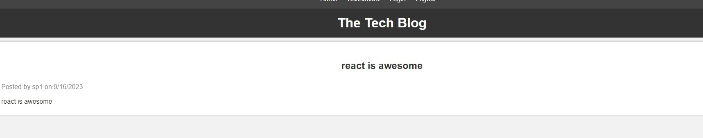
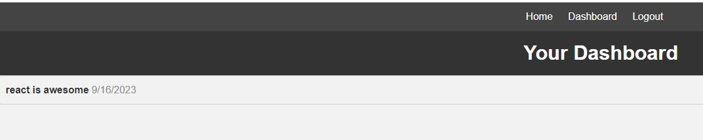
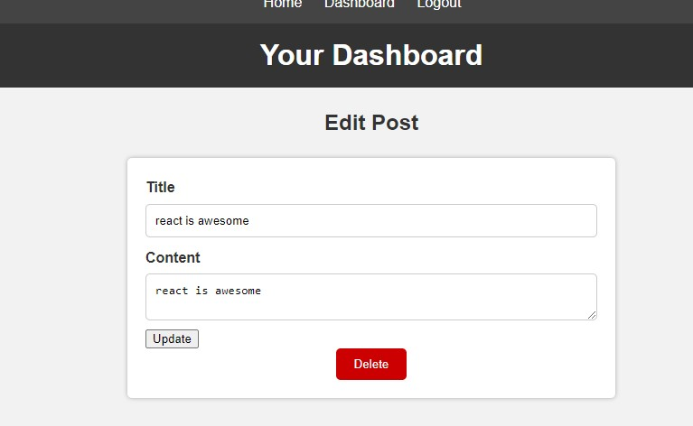
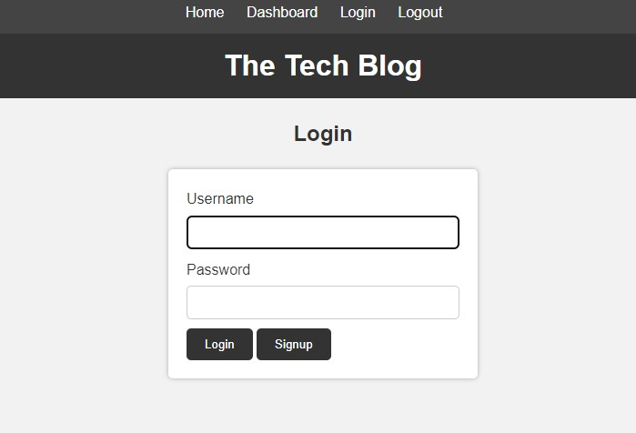
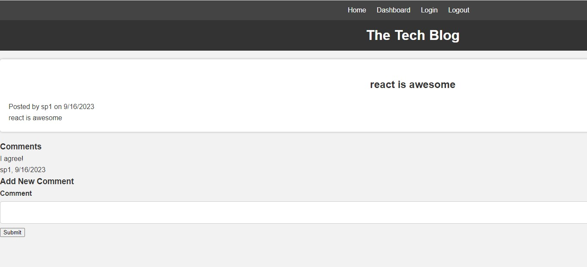

# Tech-Blog

## Description

Tech Blog is a MVC modeled web application that users can share their tech post, and comment under others' tech posts. User must be signed in to be able to post or comment.

## Installation and Usage

1. Use deployed link from Heroku: https://sp3-tech-blog-932c78b1e30d.herokuapp.com/
2. In case the link in Heroku is expired, follow the instructions below:
   - Download the repository from the GitHub Repo: https://github.com/sptres/Tech-Blog
   - run 'npm install'
   - run 'mysql -u root -p' then put in your mysql password
   - run 'source db/schema.sql' then 'exit' to exit out of mysql commands
   - run npm start and go to localhost:3005 to use Tech Blog Web App

## Screenshots

Showing all post from main.hbs

Showing posts posted by the user in dashboard.hbs

Showing edit post function in editPost.hbs

Login form

singlePost.hbs that shows single post and its comment/s

## Contribution

Seung Hyuk Park, Full-stack developer. Github: https://github.com/sptres

### Bugs, Issues & Questions

To report any bugs, issues or to ask any questions regarding the product, please email your concerns at shawnpark2397@gmail.com or visit: https://github.com/sptres/Tech-Blog/issues
